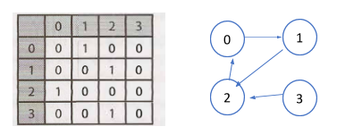

# Graph & Trees

## Problem A
"Es posible representar un grafo con una matriz, como se muestra en el siguiente diagrama:



Escriba un algoritmo que a determine si dos nodos están conectados. 
Por ejemplo: El nodo 3 si está conectado con el nodo 0, pero el nodo 0 
no está conectado con el nodo 3. "


In order to solve this problem we noticed that can be solved the given adjacent matrix
and for that it's well known that we can use Breadth First Search (BFS) to solve this. 
So we tried that logic into our algorithm, bur instead of doing all vertex and edges, when 
stop our execution whenever our B node is found

Also we took the liberty to take this assumption:
1. Given the nodes A nd B, where A and B belongs to the same Graph G, in the case
that A and B are the same node, they will have state of connected.


```cpp
bool BFS(int A, int B){

    if(A==B) // if both nodes are equal, they are already connected
        return true;

    bitset<MAX> visited;
    queue<int> path;

    path.push(A); // add A node to path
    visited[A] = 1; // and marked as visited

    while( !path.empty() ){

        int i = path.front(); // starts with the first adjacent node on the queue
        path.pop(); // once it has been setted,

        for(int j = 0; j < 4; j++){

            if( graph[i][j] ){ // if has an adjacent node

                if( !visited[j] ){ // if not visited yet
                    if(j == B){ // When found node
                        return true;
                    }
                    else{
                        visited[j] = 1;
                        path.push(j);
                    }
                }
            }
        }
    }

    return false;
}
```

Then we use this peace of code this way, in order to check both nodes from each side:

```cpp
    cout << "Are Node \"" << A << "\" and node \"" << B << "\" connected? " << endl;
    if( BFS(A,B) )
        cout << "R: Yes" << endl;
    else
        cout << "R: No" << endl;

    cout << "Are Node \"" << B << "\" and node \"" << A << "\" connected? " << endl;
    if( BFS(B,A) )
        cout << "R: Yes" << endl;
    else
        cout << "R: No" << endl;
```