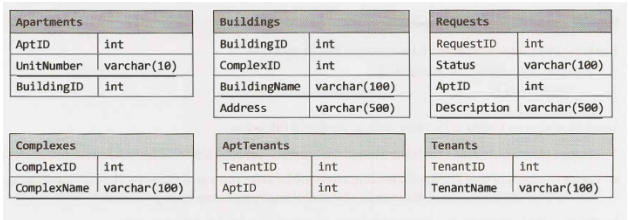
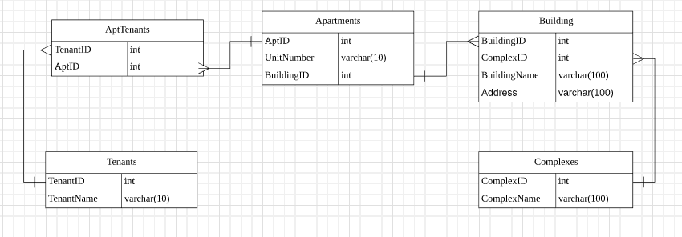
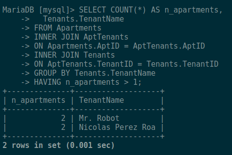

# Database 

## Problem A

"Considere para las siguientes preguntas el siguiente modelo de base de datos. Cada departamento (Apartment) puede
 tener multiples arrendatarios (Tenants). Cada departamento pertenece a un edificio (Buildings) 
 y cada edificio pertenece a un complejo (Complexes)


 
Escriba una consulta que obtenga la lista de Arrendatarios (Tenants) que están arrendando más de un departamento."

Firstly, in order to understand more graphically, we decided to create the model base
on that description



We ran the following SQL query that fulfills the given requirement.

```sql
SELECT COUNT(*) AS n_apartments,
    Tenants.TenantName  
FROM Apartments 
INNER JOIN AptTenants  
    ON Apartments.AptID = AptTenants.AptID  
INNER JOIN Tenants  
    ON AptTenants.TenantID = Tenants.TenantID 
GROUP BY Tenants.TenantName 
HAVING n_apartments > 1;
```

that's our final output given the above query. 


